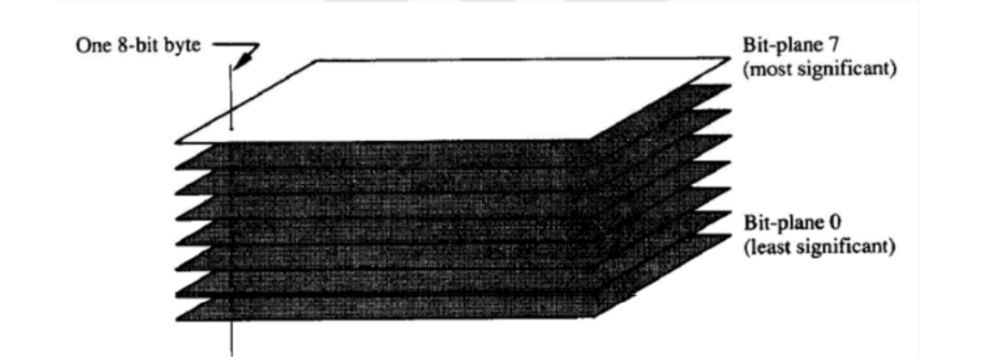

# bit-plane_slicing_embedding_numbers
## bit-plane slice
In this project, I used ```bit-plane slicing``` to embed an 8 digit number in a picture. First let us have a look at ```bit-plane slicing``` and its definition.

when er want to extract bit planes of an image, first we have to represent each pixel in ```binary``` form. then, we will put all of the MSBs (Most Significant Bits) in the first plane. (First plane consists only ```0``` and (usually) ```128```). then, in the second plane we will put all of the second highest value in each pixel. we will continue this approach for all 7 planes.(I consider the value of each pixel from ```0``` to ```255``` which is ```1111111``` in binary system).
ti make it more explicit, look at the following image:



for an image, I extracted its bit-planes and this is the result:


Now, what if the original image were just a meaningless image and when we would extract its bit planes, we would saw some specific images? 

In this project I made an algorithm to make this possible.

Here are the results of the project: 

this is our meaningless image:


and once we extract the bit planes, we will see 8 numbers:


you can embed any 8-digit number like this.